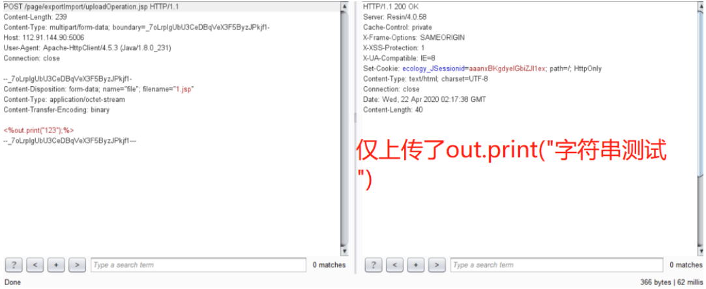
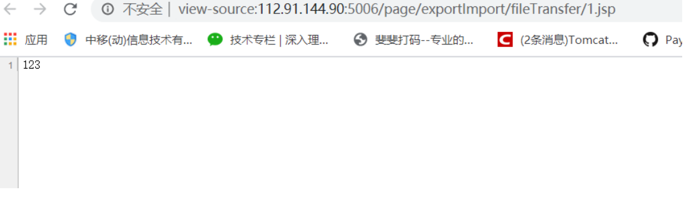

# 泛微OA V9 任意文件上传

## 漏洞描述

泛微OA V9 存在文件上传接口导致任意文件上传

## 漏洞影响

> [!NOTE]
>
> 泛微OA V9

## 漏洞复现

漏洞位于: /page/exportImport/uploadOperation.jsp文件中

Jsp流程大概是:判断请求是否是multipart请求,然就没有了,直接上传了,啊哈哈哈哈哈

重点关注File file=new File(savepath+filename),

Filename参数,是前台可控的,并且没有做任何过滤限制

利用非常简单,只要对着

127.0.0.1/page/exportImport/uploadOperation.jsp

来一个multipartRequest就可以,利用简单,自评高危!!

然后请求 然后请求路径:

page/exportImport/fileTransfer/1.jsp

