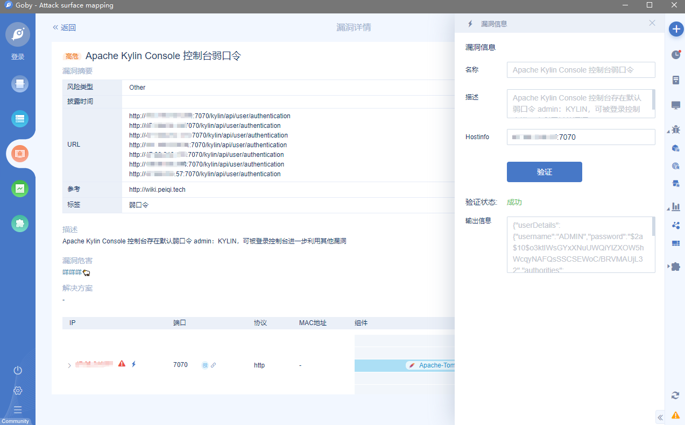

## Apache Kylin Console 控制台弱口令

## 漏洞描述

Apache Kylin Console 控制台存在默认弱口令 **admin：KYLIN**，可被登录控制台进一步利用其他漏洞

## 漏洞影响

> [!NOTE]
>
> Apache Kylin

## 漏洞复现

打开后目标站点使用默认账号密码**admin/KYLIN**登录，出现初始界面即为成功

## Goby & POC

> [!NOTE]
>
> 已上传 https://github.com/PeiQi0/PeiQi-WIKI-POC Goby & POC 目录中
>
> Apache_Kylin_Console_Default_password.json

