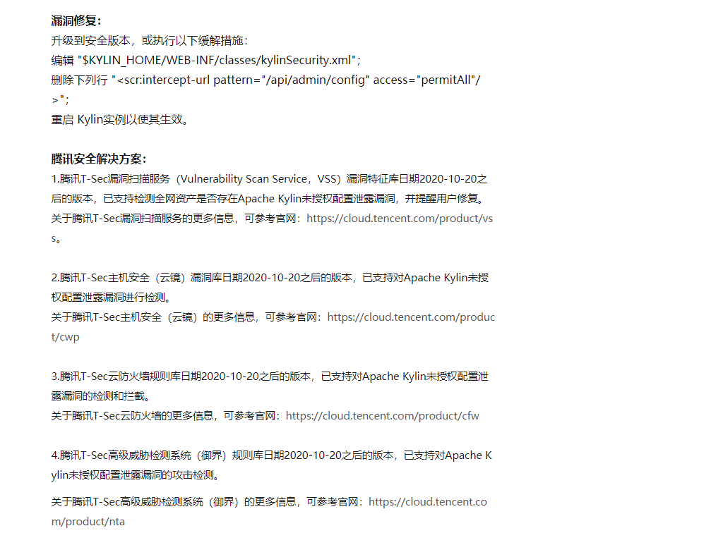
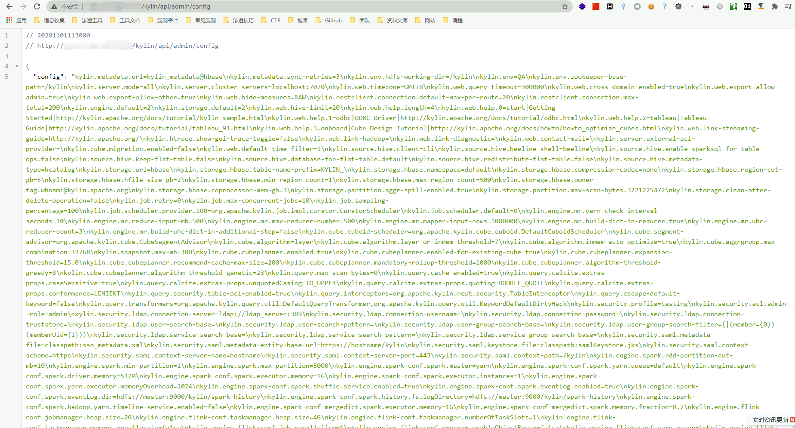

# Apache Kylin的未授权配置泄露 CVE-2020-13937

### FOFA

app="APACHE-kylin"

### **受影响的版本：**

Apache Kylin 有一个restful api会在没有认可认证的情况下暴露配置信息。

Kylin 2.x.x

Kylin <= 3.1.0

Kylin 4.0.0-alpha

### 漏洞利用

根据漏洞情报

漏洞利用POC为http://xxx.xxx.xxx.xxx/kylin/api/admin/config

### 参考

[CVE-2020-13937|Apache Kylin的未授权配置泄露漏洞，腾讯安全全面支持检测](https://s.tencent.com/research/bsafe/1156.html)